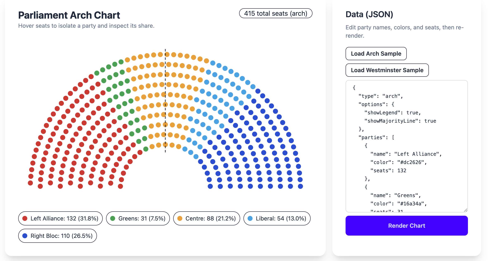

# Interactive Parliament Arch (Local HTML)

A frontend-only parliament arch chart that runs locally in the browser with no backend.



Live demo: [https://hankhank10.github.io/parliament-display/](https://hankhank10.github.io/parliament-display/)

## Run

1. Open `index.html` in any modern browser.
2. Edit the JSON in the right panel and click **Render Chart**.
3. Use **Load Arch Sample** or **Load Westminster Sample** for dev/test seed data.

## JSON shape

```json
{
  "type": "arch",
  "options": {
    "showLegend": true,
    "showMajorityLine": true
  },
  "parties": [
    { "name": "Party A", "color": "#ef4444", "seats": 120 },
    { "name": "Party B", "color": "#3b82f6", "seats": 90 }
  ]
}
```

Westminster layout example:

```json
{
  "type": "westminster",
  "options": {
    "showLegend": true,
    "showWestminsterHeaders": true
  },
  "parties": [
    {
      "name": "Government A",
      "color": "#ef4444",
      "seats": 140,
      "side": "government"
    },
    {
      "name": "Government B",
      "color": "#f97316",
      "seats": 35,
      "side": "government"
    },
    {
      "name": "Opposition A",
      "color": "#3b82f6",
      "seats": 120,
      "side": "opposition"
    },
    {
      "name": "Opposition B",
      "color": "#0ea5e9",
      "seats": 45,
      "side": "opposition"
    }
  ]
}
```

## Behavior implemented

- Seats rendered in a semicircular parliament arch with parties allocated left-to-right across the chamber.
- Optional Westminster layout with government and opposition on opposite sides of an aisle.
- JSON option `options.showLegend` toggles the legend/key.
- JSON option `options.showMajorityLine` toggles a 50% marker line on the arch layout.
- JSON option `options.showWestminsterHeaders` toggles \"Government\" and \"Opposition\" headers in Westminster mode.
- Party blocks colored by input JSON.
- Hover over any seat greys out all other parties.
- Hover tooltip shows party name, seat count, and % of parliament.
- Inline JSON validation errors.

## License

This project is licensed under the MIT License. See [LICENSE](LICENSE) for details.
